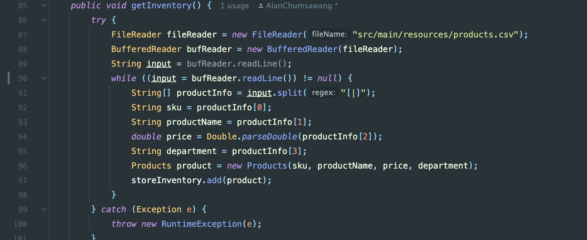
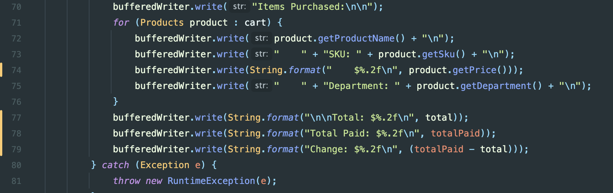

# Online Store

## Author: Alan Chumsawang

## Description
The Online Store is a Java-based application that allows users to browse an inventory of products, add items to their cart, and checkout. The application supports payment via cash or card and generates a receipt with detailed information about the purchase.

## Features
- Display inventory of products
- Add products to cart
- Remove products from cart
- Checkout and generate receipt
- Search inventory by name, department, or price

## Technologies Used
- Java
- Maven

## Usage
1. Upon running the application, you will be presented with a menu:
    - Display Inventory
    - Display Cart
    - Exit
2. Follow the prompts to browse the inventory, add items to your cart, and checkout.

## File Structure
- `src/main/java/com/pluralsight/onlinestore/Store.java`: Main class that handles the store operations.
- `src/main/java/com/pluralsight/onlinestore/Products.java`: Class representing a product.
- `src/main/resources/products.csv`: CSV file containing the product inventory.
- `reciepts/date-time.txt`: New receipt file generated for each transaction ordered by date and time. giving each receipt a unique name.'

## Concepts Practiced
- BufferedReader and InputStreamReader

- BufferedWritter and FileWriter

- Object-oriented programming
- Exception handling
- File I/O

